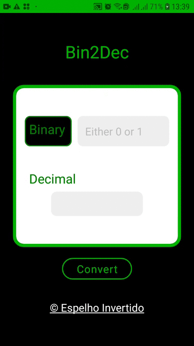

<h1 align="center">
 
  Bin2Dec - Mobile
</h1>

Mobile application to convert binary number to decimal number.

 <a href="#-features">Features</a> •
 <a href="#-tech">Technologies</a> • 
 <a href="#-license">License</a> • 
 <a href="#-license">Useful Links</a> • 

  

<h4 align="center"> 
	Stand by ...  🚧
</h4> 

**Source:** https://github.com/florinpop17/app-ideas/blob/master/Projects/1-Beginner/Bin2Dec-App.md

**Tier:** 1-Beginner

Binary is the number system all digital computers are based on.
Therefore it's important for developers to understand binary, or base 2,
mathematics. The purpose of Bin2Dec is to provide practice and
understanding of how binary calculations.

Bin2Dec allows the user to enter strings of up to 8 binary digits, 0's
and 1's, in any sequence and then displays its decimal equivalent.

# Features 

-   [x] User can enter up to 8 binary digits in one input field
-   [x] User must be notified if anything other than a 0 or 1 was entered
-   [x] User views the results in a single output field containing the decimal (base 10) equivalent of the binary number that was entered

### 🛠 Technologies 

The following tools was used in this project:
- [React Native](https://reactnative.dev/)

## Getting started 

In the project directory, you can run:

### `yarn start`

Runs the app in the development mode. 
Open [http://localhost:3000](http://localhost:3000) to view it in the browser.

The page will reload if you make edits. 
You will also see any lint errors in the console.

## License 

	This project is licensed under the MIT License - see the  
  
	for details.

## Useful links and resources 

[Binary number system](https://en.wikipedia.org/wiki/Binary_number)
